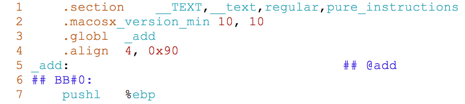
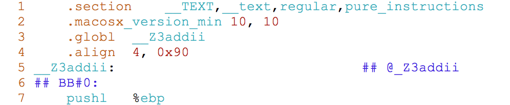

## extern的用法

### 声明变量

​	`extern`可以用来修饰变量（或常量），当被修饰的变量没有进行初始化时为声明，如：`extern int a;`表明该变量在其它编译单元已定义，这样可以实现多个编译单元之间使用同一变量。若在使用`extern`修饰变量时对变量进行了初始化，则为定义变量，不是声明，如`extern int a = 10;`。

### 声明函数

​	`extern`可以用来声明函数，表明该函数可能在别的编译单元中定义，默认情况下的函数声明编译器都会认为是`extern`的，此时函数的定义可以在当前编译单元，也可以在其他编译单元。与之对应的，若使用static声明函数，则该函数的实现只能在当前编译单元。

### extern "C"

​	C和C++在编译后生成函数名称的规则有所不同，C一般保持原有函数名称不变，由于C++支持函数重载，因此需要更多的规则来区分不同的重载函数，下面是函数`int add(int a, int b);`分别使用C和C++编译器编译成汇编后的结果。

​	由于C和C++生成函数名称的规则不同，因此，当你编写的C++程序需要链接其他第三方库时，默认情况下编译器会使用C++的规则来连接，若该第三方库是使用C编译器编译的，此时连接器会因找不到对应的函数而报错。

​	为了解决这个问题，在C++中包含要链接的库的头文件时，可以添加`extern "C"`来告诉编译器，按照C语言的规则来链接该库。